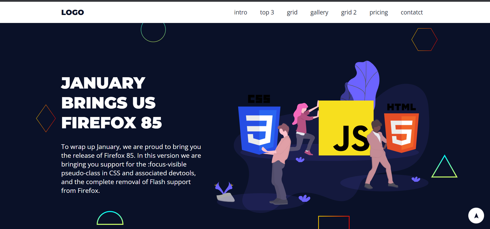

# My first landing page :rocket:

> Minha primeira langing page criada através do curso da udemy
### Funcionalidades

* Landing Page
* Responsivo
* sandwich menu
* Back to top

:link: Link para acessar a landing page

https://tdevlandingpage.netlify.app/

### Tecnologias Utilizadas

* HTML5
* CSS3

### Layout Desktop

### Layout Mobile

## ✒️ Autor
# :raising_hand: Thiago Alves

- Linkedin - [Thiago Alves](https://www.linkedin.com/in/thiago-alves-010915274/)
- GitHub - [Thiago87dev](https://github.com/Thiago87dev)
- Frontend Mentor - [@MrThiago87](https://www.frontendmentor.io/profile/MrThiago87)
- Instagram - [@thiagopaulista87](https://www.instagram.com/thiagopaulista87/)
